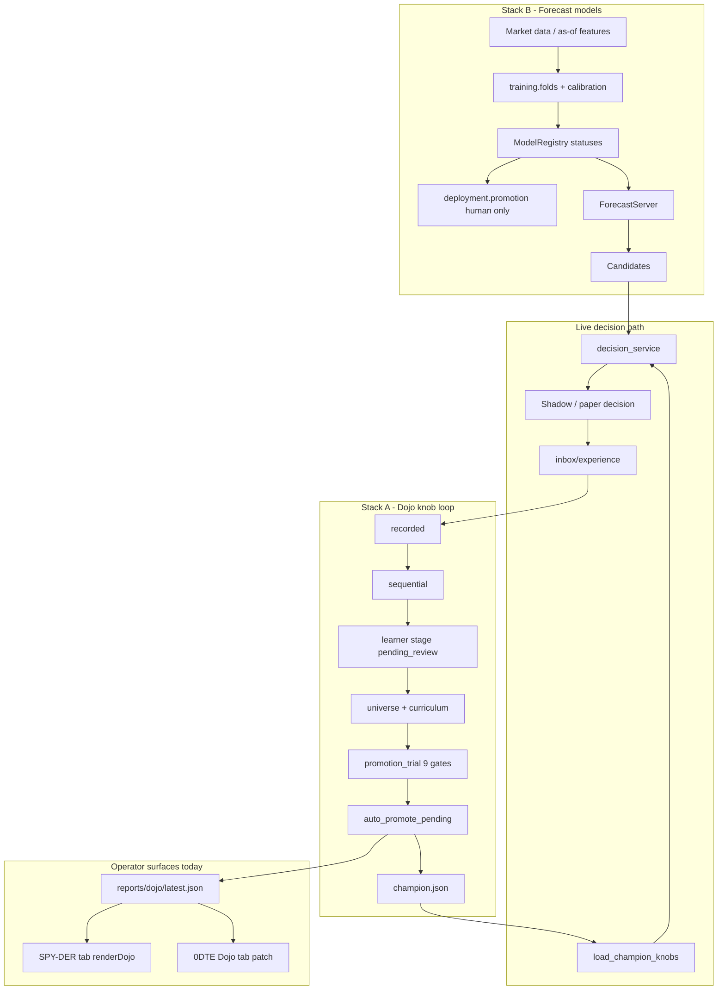
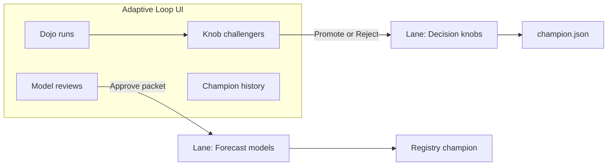

# Training & Dojo — Full Map and Consolidation Plan

**Status: proposal.** Maps how “training,” Dojo, learning, and promotion
actually work across SPY-DER and the legacy 0DTE dashboard, then recommends how
to make the operator surface one coherent loop without collapsing two different
blast-radius systems.

Related: [`ops/dojo.md`](ops/dojo.md), [`DOJO_MIGRATION.md`](DOJO_MIGRATION.md),
[`TARGET_ARCHITECTURE.md`](TARGET_ARCHITECTURE.md),
[`DECISION_LIFECYCLE.md`](DECISION_LIFECYCLE.md).

---

## Verdict

Yes — **not putting the operator experience together is redundant.**

What is *not* redundant is the underlying split:

| Loop | What it changes | Blast radius | Who may promote |
|---|---|---|---|
| **Dojo / learning** | `configs/champion.json` **DecisionKnobs** (size cap, confidence floor, OOD abstain) | Can only **reduce** exposure | Auto after 9 evidence gates, or human `PROMOTE` |
| **Training / deployment** | Forecast **model artifacts** in `ModelRegistry` | Changes *what is predicted* (unbounded) | **Human only** (master spec) |

Today those two loops share vocabulary (`champion`, `pending_review`,
`promote`, “training”) and **two dashboards**, but neither pending-review queue
is actionable from a UI. Operators experience “training” as one product; the
code treats them as strangers that happen to reuse the same words.

**Target:** one Adaptive Loop surface (Dojo + model lifecycle + pending review
actions) with two clearly labeled promotion lanes — knobs vs models — not two
tabs that look like competing trainers.

---

## 1. End-to-end map (both stacks)

### Stack A — Dojo / learning (decision knobs)

| Piece | Path | Role |
|---|---|---|
| Runner | `src/spy_der/dojo/runner.py` | Phases: recorded → sequential → learner → universe → promotion |
| Curriculum | `dojo/curriculum_weights.py`, `learning/gaps.py` | Sampling pressure vs “should we try to fix this archetype” |
| Learner | `learning/learner.py` | Diagnose → hypothesize → optimize → **stage only** |
| Trial | `learning/promotion_trial.py` | Re-run with challenger; 9 gates |
| Promote | `learning/promotion.py` | `auto_promote_pending` or `promote_pending(human_ack="PROMOTE")` |
| Live read | `decisions/champion.py` + `knobs.py` | Enacted on next tick in `decision_service` |
| Reports | `dojo/reports.py`, `dojo/human.py` | `latest.json` + plain-English `human` block |
| Timers | `deploy/spy-der-dojo-{daily,recent,weekly}` | Nightly cadence |

Dojo does **not** train ML models. “Training the gaps” means re-weighting
synthetic worlds and staging safer knobs.

### Stack B — Training / forecasting (models)

| Piece | Path | Role |
|---|---|---|
| Datasets / folds | `training/datasets.py`, `folds.py`, `asof.py` | Leakage-safe observations, expanding session folds |
| Calibration | `training/calibration.py` | Fit on OOF scores only |
| Registry | `training/registry.py` | Status ladder → serving modes |
| Model promote | `deployment/promotion.py` | Human-gated `PromotionReviewPacket` → `DeploymentManifest` |
| Serving | `forecasting/runtime.py` | `ForecastServer(load_mode="champion")` |
| Engine gate | `runtime/engine.py` | Forecast stage refuses heuristic if no trained group |

Training never writes `champion.json`. The Dojo never calls the registry.

### Where they meet

Forecasts (B) become candidates on the live packet. Dojo (A) **scores** those
decisions on recorded/synthetic tape and may tighten knobs on top. The closed
loop for knobs is: experience → Dojo → `champion.json` → next tick. Model
artifacts are inputs Dojo evaluates, not what Dojo promotes.

---

## 2. 0DTE vs SPY-DER — systems comparison

| Concern | SPY-DER (source of truth) | 0DTE (legacy / consumer) |
|---|---|---|
| Dojo runner | `spy_der.dojo` + `spy_der.learning` | Old `dojo.py` / `zerodte-dojo-*` **superseded**; deletion still deferred on 0DTE PR |
| Model training | `spy_der.training` + `forecasting` | Old `prediction/**`, `walk_forward.py` marked reimplement/replace |
| Champion knobs | `decisions/champion.py` | Interim `champion_reader` adapter in 0DTE tree (if landed) |
| Model promotion | `deployment/promotion.py` | Old `prediction/promotion.py` → mapped away |
| Dashboard Dojo UI | `runtime/ui/spy-der-tab.js` `renderDojo` | Separate JS in `dashboard/static/app.js` (patch in `integrations/zerodte/`) |
| Data feed for tab | `GET /v1/dojo/latest` (or file `latest.json`) | Proxies `/api/spy-der/*` or reads files |
| Learning tab | No separate tab — learning is inside Dojo reports | Residual sibling tab in 0DTE dashboard (`tab-learning-dot`) |
| Ownership target | Complete system (`TARGET_ARCHITECTURE.md`) | Deprecated after cutover |

**Both “models” in production terms:**

1. **Forecast model group** (registry champion) — predicts the market.
2. **Decision authority + knobs** (Dojo champion) — chooses / shrinks trades on top of candidates.

0DTE historically owned both runners and both UIs. After PR #150 and the Dojo
migration, **SPY-DER owns the brains**; 0DTE still hosts a second Dojo renderer
and deferred deletions. That dual UI is the main cross-repo waste.

---

## 3. Naming collisions (why it feels like one messy product)

| Word | Meaning A | Meaning B |
|---|---|---|
| **champion** | `configs/champion.json` knobs | Registry / `DeploymentMode.CHAMPION` model |
| **promotion** | `learning.promotion` | `deployment.promotion` |
| **pending_review** | Dir under `configs/` | Registry status string |
| **training** | “Dojo training room” / training the gaps | `spy_der.training` ML fit |
| **candidate** | Trade candidate on a packet | Staged Dojo challenger **or** registry status |

Same English, three state machines, zero shared enum. That is why a
“Training tab” that cannot select promotions feels broken: the product language
promises one lifecycle; the code has two unfinished ones.

---

## 4. What is already efficient (keep)

1. **Knob auto-promote vs model human-only** — justified by blast radius. Knobs
   can only stand down; models change the forecast surface. Do not merge those
   promotion *functions*.
2. **Learner stages; trial promotes** — recommendation alone never writes
   champion. Keep.
3. **`human` report block** — one plain-English payload for any dumb renderer.
4. **SPY-DER as Dojo owner** — 0DTE-as-consumer is the correct boundary; delete
   duplicate 0DTE runners, not the SPY-DER loop.
5. **Folds vs sequential Dojo** — same walk-forward *idea*, different outputs
   (OOF calibration vs authority forward-transfer). Keep separate; optionally
   share a session-window helper later.

---

## 5. What is wasteful (fix)

| ID | Waste | Evidence |
|---|---|---|
| W1 | Dual Dojo renderers | `spy-der-tab.js` + 0DTE `dojo-tab-human-ui.patch` both paint `latest.json` |
| W2 | Un-actionable pending review | `list_pending` / `promote_pending` / `reject_pending` exist; UI and API are GET-only / “cannot promote” |
| W3 | Second pending queue with no callers | `deployment.promotion.PromotionReviewPacket` — tests/runbooks only |
| W4 | Triple lifecycle vocabulary | registry statuses, deployment modes, learning dir names |
| W5 | “Training” metaphor on Dojo UI | Collides with `spy_der.training`; operators think the tab trains models |
| W6 | Stale timer comments | `spy-der-dojo-*.service` still say “Never auto-promotes” while default is on |
| W7 | Spec drift | Master spec “No automatic promotion” vs shipped knob auto-promote |
| W8 | Deferred 0DTE deletions | Old dojo timers/modules still listed in migration inventory |

---

## 6. Consolidation plan — one Adaptive Loop

### Principle

**One operator surface. Two promotion lanes. Shared lifecycle words.**

### Phase A — Language and truth (docs + UI copy, low risk)

1. Rename Dojo UI “training room” → **Dojo** / **Adaptive loop** / **Sparring**
   (pick one; stop saying “training” for knobs).
2. Label every champion/promote string as **knobs** or **model**.
3. Amend master spec §69: “No automatic **model** promotion”; document
   evidence-gated **knob** auto-promotion.
4. Fix systemd comments to match `SPY_DER_DOJO_AUTO_PROMOTE` reality.

### Phase B — Single Dojo surface (cross-repo)

1. Treat `spy-der-tab.js` as the only Dojo renderer.
2. On 0DTE: embed/mount that tab; delete the patched `renderDojo*` fork once
   the embed is live.
3. Finish deferred 0DTE deletions (`dojo.py`, `zerodte-dojo-*`) per
   `0DTE_DASHBOARD_ADAPTER.md`.

### Phase C — Actionable review (closes the original gap)

1. Add an **operator-only** write path (CLI first, then authenticated POST — not
   the public read-only tab’s anonymous GETs):
   - list pending knob challengers
   - promote / reject with explicit ack
   - rollback champion
2. Surface pending challengers **inside the same Dojo panel** as the run that
   staged them (select row → gates → Promote / Reject).
3. Keep auto-promote as default for knobs; UI is the override when auto is off
   or when a human wants to reject/rollback.
4. Either wire `deployment.promotion` into the same panel as “Model reviews”
   or formally mark it scaffold-until-wired so it does not look like a second
   orphan queue.

### Phase D — Shared lifecycle vocabulary (code hygiene)

1. Extract one `LifecycleStatus` (or equivalent) used by registry, deployment
   manifests, and learning dir/status reporting.
2. Keep two promote implementations; both speak the same status grammar.
3. Optional later: shared `session_windows(embargo)` for folds + sequential.

---

## 7. Efficiency / effectiveness gains

| Change | Efficiency | Effectiveness |
|---|---|---|
| One Dojo UI | Stop maintaining two JS renderers + patch files | Operators see one truth |
| Select → promote/reject in that UI | No REPL for human ack | Human judgment actually usable when auto is off or wrong |
| Clear knobs vs model labels | Less mistaken “promote the model from Dojo” | Safer governance |
| Shared lifecycle enum | One place to evolve states | Fewer silent drifts between stacks |
| Kill 0DTE dojo runners | One timer family, one report root | No double nightly exams |
| Spec + timer comment fix | Zero runtime | Stops false confidence about what is automatic |

What **not** to do: merge `spy_der.training` into `spy_der.dojo`, or auto-promote
models because knobs already auto-promote. That would be simpler naming and
worse safety.

---

## 8. Recommended default for the original ask

> “I want to select and promote” on the training/Dojo tab.

Implement **Phase C on the SPY-DER Dojo surface**, with auto-promote remaining
the default for knobs:

- Selecting a Dojo run shows staged / pending challengers for that lineage.
- Promote / Reject call the existing `promote_pending` / `reject_pending` APIs
  behind an authenticated operator channel.
- Model registry promotion stays a separate labeled lane (or stays CLI-only
  until Stack B has a real review queue).

That puts the redundant *experience* together without pretending knobs and
models are the same artifact.

---

## 9. File index (quick)

**SPY-DER Dojo / knobs:** `src/spy_der/dojo/`, `src/spy_der/learning/`,
`src/spy_der/decisions/{champion,knobs}.py`, `deploy/spy-der-dojo-*`,
`src/spy_der/runtime/ui/spy-der-tab.js`, `docs/ops/dojo.md`

**SPY-DER models:** `src/spy_der/training/`, `src/spy_der/forecasting/`,
`src/spy_der/deployment/promotion.py`

**0DTE residue:** `integrations/zerodte/dojo-tab-human-ui.patch`,
`integrations/zerodte/README-dojo-human-ui.md`,
`docs/ops/0DTE_DASHBOARD_ADAPTER.md`, `migrations/inventory/zerodte_disposition.json`
